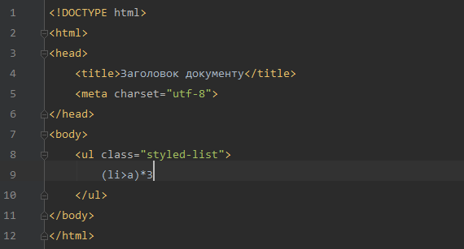
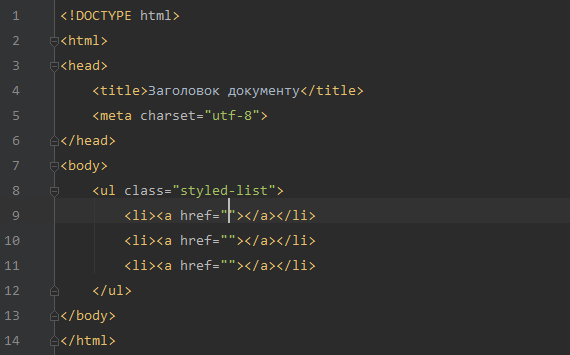

# Emmet

**Emmet** \(раніше називався Zen Coding\) — набір інструментів, який дозволяє швидше писати HTML \(або будь-який інший структурований формат коду\). Можливість досягається за рахунок використання спеціальних комбінацій коду і клавіш. Після чого короткі позначення, які схожі на CSS селектори, трансформуються в HTML-код.

Наприклад, в редакторі, який підтримує даний інструмент, вводимо короткий запис

```
(li>a)*3
```



і тиснемо клавішу `Tab`. Після чого короткий код розгортається у відповідний HTML



Детальніше про Emmet можна почитати на [emmet.io](http://emmet.io/).

