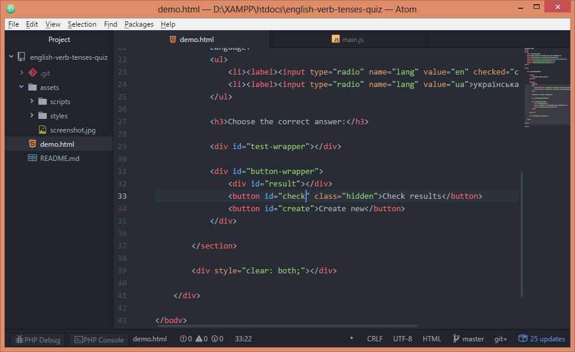
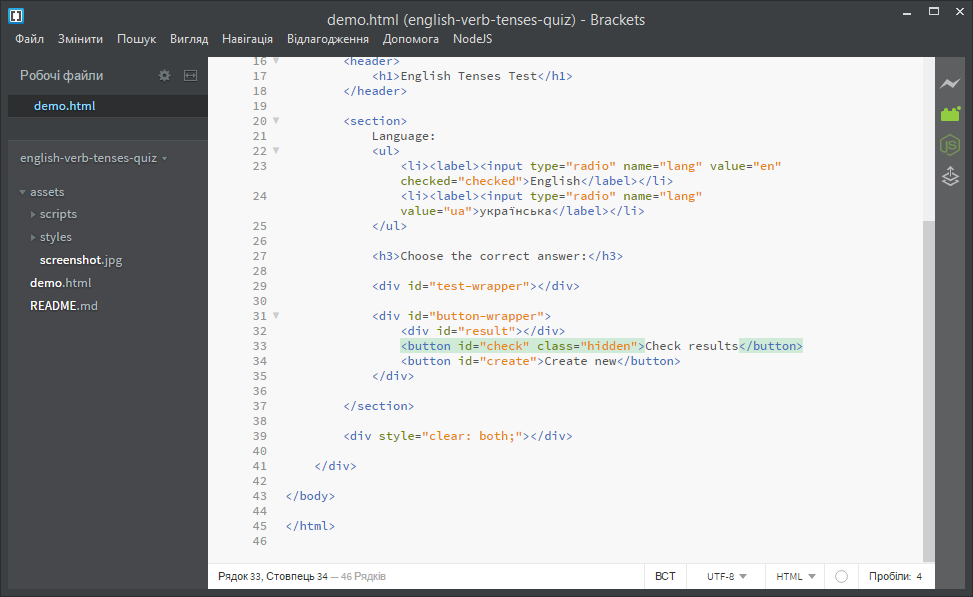
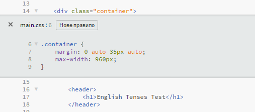
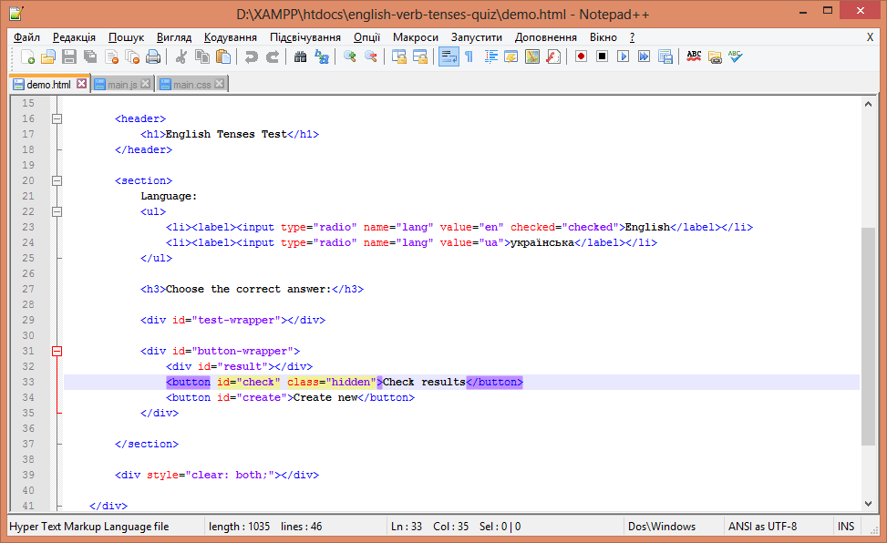
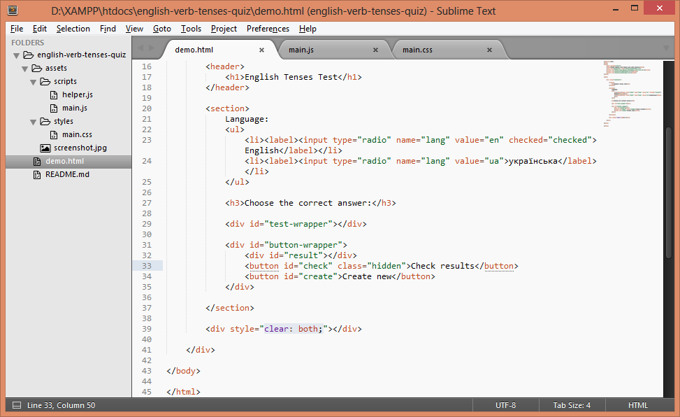
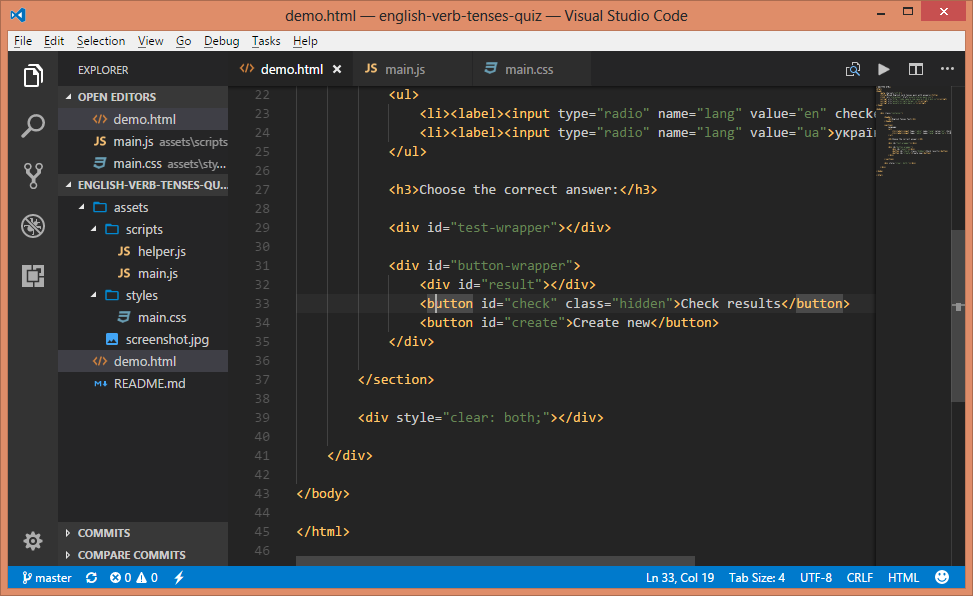

# Редактори коду

В чому писати код? Відповідь завжди суб'єктивна. Є чимало хороших варіантів і з часом ви підберете той редактор, який буде найзручнишим для вас. Але перед цим слід уточнити, що умовно редактори можна поділити на **текстові редактори** і **IDE** (англ. Integrated Development Environment).

В той час як перші є легкими, другі (наприклад, Eclipse, NetBeans або Aptana Studio) — важкі, вимогливі до ресурсів, проте мають значно більше корисних функцій.

### Вимоги до сучасного редактора коду
* Підсвічування синтаксису мови програмування, на якій ви пишете код.
* Підказки коду, авто-завершення.
* Можливість відлагоджувати код (англ. debugging).
* Розширюваність за допомогою плагінів.
* Можливість працювати з Git (або іншою системою керування версіями файлів).
* Підтримка препроцесорів, якщо ви їх використовуєте (LESS / Sass тощо).
* Наявність вбудованого FTP-клієнта, SSH тощо.

Нижче в алфавітному порядку наведено невеличкий список сучасних редакторів коду.

## Текстові редактори

### Atom від GitHub

Сайт: [https://atom.io/](https://atom.io/)

Atom позиціонують, як текстовий редактор, створений для потреб сучасних розробників. Завдяки відкритому API має чимало послідовників та силу-силенну плагінів. Atom — безкоштовний і працює на Windows, OS X та Linux.

### Brackets від Adobe

Сайт: [http://brackets.io/](http://brackets.io/)

Brackets зосереджений на потребах веб-дизайнерів з вбудованою підтримкою HTML, CSS та JavaScript. Brackets — безкоштовний, легкий у використанні, швидкий і має багато додаткових плагінів. Працює на Windows, OS X та Linux.

З цікавих особливостей Brackets можна зазначити:

* попередній перегляд (англ. Live Preview), який дозволяє в реальному часі бачити CSS та HTML зміни в браузері;
* швидке редагування CSS одразу в HTML коді.

Рис. Швидке редагування CSS одразу в HTML коді (комбінація клавіш Ctrl + E у Windows).

### Notepad++

Сайт: [https://notepad-plus-plus.org/](https://notepad-plus-plus.org/)

Notepad++ — безкоштовний, невимогливий до ресурсів і дуже швидкий редактор коду, який, щоправда, доступний лише для Windows. Даний редактор призначений для тих, хто полюбляє простий інтерфейс. Базовий функціонал Notepad++ можна доповнювати за допомогою плагінів.

### Sublime Text (платний)

Сайт: [https://www.sublimetext.com/](https://www.sublimetext.com/)

Sublime Text — це надзвичайно потужний текстовий редактор для коду, який можна розширити за допомогою плагінів. Вам сподобається його витончений інтерфейс, набір корисних функцій та вражаюча продуктивність. Редактор платний, але нема обмеження на те, як довго ви можете використовувати пробну версії. Sublime Text доступний на Windows, OS X та Linux.

### Visual Studio Code від Microsoft

Сайт: [https://code.visualstudio.com/](https://code.visualstudio.com/)

Visual Studio Code — це легкий текстовий редактор із відкритим кодом, який працює на всіх основних платформах — Windows, OS X і Linux. За допомогою розширень можна додати новий функціонал, тему до вподоби тощо.

## IDE

### Aptana Studio

Сайт: [http://www.aptana.com/](http://www.aptana.com/)

### Netbeans

Сайт: [https://netbeans.org/](https://netbeans.org/)

### IDE від JetBrains (платні WebStorm, PhpStorm тощо)

Сайт: [https://www.jetbrains.com/](https://www.jetbrains.com/)

## Он-лайн редактори

Останнім часом швидкими темпами розвиваються он-лайн редактори: 

*  **Cloud9** — [https://c9.io/](https://c9.io/)
*  **ICEcoder** — [http://icecoder.net/](http://icecoder.net/)
*  **Codio** — [http://codio.com/](http://codio.com/)
*  **Codeanywhere** — [https://codeanywhere.com/](https://codeanywhere.com/)

Їх не потрібно встановлювати, вони працюють в браузері як Google Docs.

