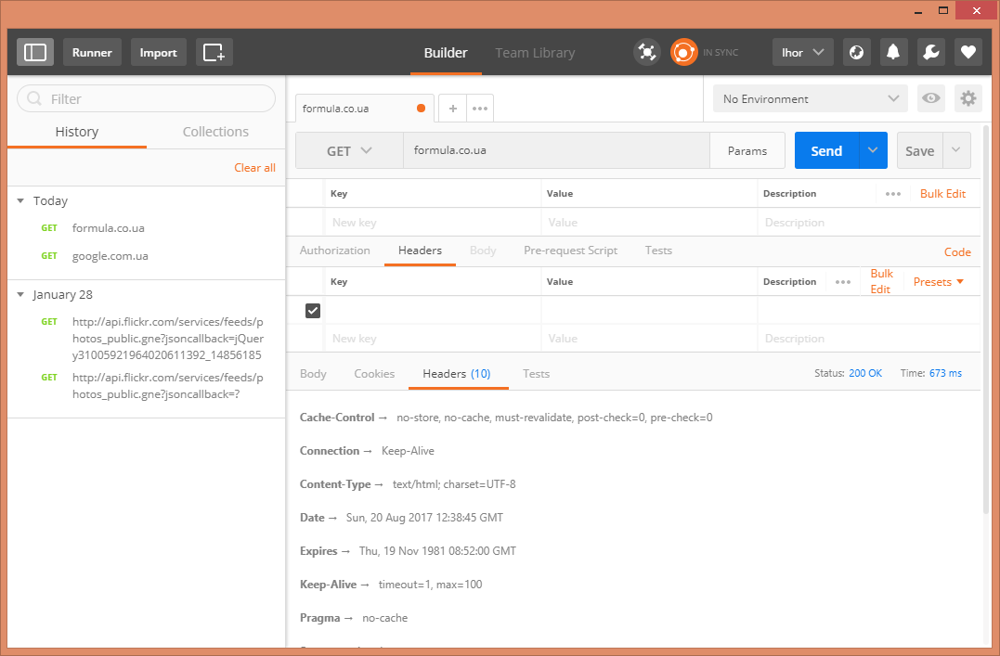

# HTTP

**HTTP** (HyperText Transfer Protocol) — протокол передачі даних, що використовується в комп'ютерних мережах. Якщо без зайвих ускладнень, то це проста текстова мова, яка дозволяє двом комп'ютерам спілкуватися один з одним.

Клієнт надсилає цей запит на сервер і чекає відповідь.

До прикладу, ваш ноутбук чи смартфон (далі просто клієнт) звертається до сервера використовуючи HTTP і чекає відповідь. Сервер обробляє запит і повертає клієнту тією ж мовою відповідь.

Запит це свого роду текстове повідомлення, яке створюється клієнтом. Тільки оформляється воно не згідно граматики, якої вас вчили у школі, а згідно спеціальних правил, формату який відомий як HTTP.


Заголовки HTTP-запиту:

```
GET / HTTP/1.1
Host: formula.co.ua
User-Agent: Mozilla/5.0 (Windows NT 6.2; WOW64; rv:54.0) Gecko/20100101 Firefox/54.0
Accept: text/html
```
В цьому коротенькому повідомленні є все необхідне, щоб сервер зрозумів, який саме ресурс потрібен клієнту і що з ним робити.

Давайте спробуємо розібрати рядок за рядком про що йде мова в цьому повідомленні.

Перший рядок HTTP-запиту містить дві важливі речі:

* **унікальну адресу** (URI), яка ідентифікує ресурс, який потрібен клієнту. Наприклад, / (головна сторінка), /about (сторінка з деталями про сайт) тощо).

* **HTTP-метод**, який визначає, що клієнт намагається зробити з ресурсом. У випадку запиту з GET, сервер готує ресурс і повертає його назад до браузера.

Широко використовуються наступні HTTP-методи:

* GET — отримати ресурс із серверу;
* POST — створити ресурс на сервері;
* PUT — оновити ресурс на сервері;
* DELETE — видалити ресурс із серверу.

HTTP-заголовки відповіді будуть виглядають так:

```
HTTP/1.1 200 OK
Date: Sun, 20 Aug 2017 11:35:29 GMT
Server: Apache
Content-Type: text/html; charset=UTF-8
<!doctype html>
<html lang="uk">
<head>
...
</html>
```

Як бачимо, HTTP-відповідь містить корисну інформацію про відповідь:

```
Date: Sun, 20 Aug 2017 11:35:29 GMT
Server: Apache
Content-Type: text/html; charset=UTF-8
```

а також ресурс, який запросив клієнт:

```
<!doctype html>
<html lang="uk">
<head>
...
</html>
```

Перший рядок — це код статусу відповіді HTTP, який вказує на успіх запиту (в прикладі вище — 200), помилку або те, що клієнт повинен додатково щось зробити.

HTTP-відповідь містить додаткові фрагменти інформації. Із заголовків вище (див. Content-Type) видно, що до нас прийшла відповідь у форматі HTML.

Якщо виникло бажання поекспериментувати із запитами, то спробуйте розширення **Postman** для браузера Chrome. За допомогою Postman можна робити запити, використовуючи різні методи (GET, POST тощо) з довільними параметрами і заголовками.



