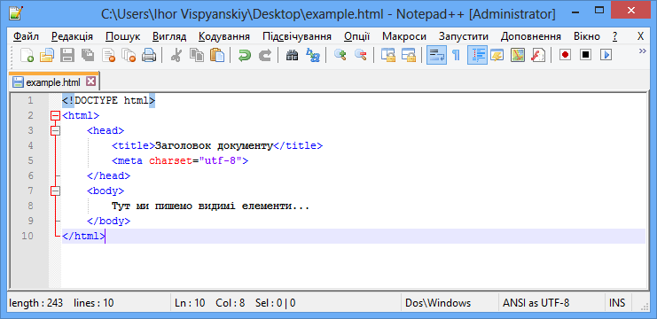

# HTML

**HTML** — легка у вивченні мова розмітки (англ. markup language), яка використовує теги (англ. HTML tag) для задання структури документу, стилю тексту. Розуміння HTML — ключовий навик для всіх, хто професійно створює контент для вебу.

Мова HTML динамічно розвивається (додаються нові теги, інші стають застарілими тощо), але основні принципи і ключові теги залишаються незміннимим. Поточну версію (специфікацію) HTML можна знайти на сайті міжнародної організації, що розробляє й впроваджує технологічні стандарти для всесвітньої павутини, [w3.org](https://www.w3.org/).


## Теги і атрибути

Давайте розберемо з вами, що собою являють HTML-теги. Ось як, наприклад, можна оформити параграф:

```
<p>Текст параграфу може бути тут...</p>
```

Огорнувши з обох боків текст тегом p, ми даємо браузеру зрозуміти, що перед нами параграф. Часто теги парні, тобто спочатку йде тег, що відкриває блок з контентом (англ. start tag), а в кінці йде закриваючий тег (англ. end tag). Також є непарні, одиничні теги, які не мають закриваючого тегу. Наприклад, тег, яким позначають картинку:

```

```

Тег також може мати атрибути. У прикладі вище в тезі img такими атребутами є src (повний шлях, за яким можна знайти зображення) та alt (текст-підказка, яка відобразиться в браузері, якщо картинку не вдасться показати). Атрибут дозволяє задати додаткову інформацію про тег.

Зауважте, що якщо елемент складається з парних тегів, то атрибути можна вказувати лише у відкриваючому. Наприклад,

```
<p class="note">Якийсь текст...</p>
```

Важливою частиною будь-якого HTML-документу є посилання. Вставити його можна наступним чином:

```
<a href="...">Текст посилання</a>
```

В атрибуті href слід вказати URL-адресу.


## Базова структура HTML-документу

```
<!DOCTYPE html>
<html>
	<head>
		<title>Заголовок документу</title>
		<meta charset="utf-8">
	</head>
	<body>
		Тут ми пишемо видимі елементи...
	</body>
</html>
```

Першим рядком ми вказали тип документу. Це необхідно, щоб браузер розумів, як слід інтерпретувати (тлумачити) поточну веб-сторінку. Існує декілька типів, при потребі ви зможете ознайомитись з ними в документації по HTML.

У прикладі вище (перший рядок) ми вказали, що будемо використовувати HTML 5 — найсвіжішу версію мови HTML. Також ми задали нашому документу заголовок і зазначили, що наш документ буде збережено в кодуванні UTF-8.

Шапка (тег **head**) містить невізуальні елементи, теги, які дозволяють підключити CSS-стилі, скрипти, задають кодування сторінки тощо. За тегом head одразу слідує тіло документу (тег **body**), в якому розміщують всі візуальні, видимі елементи, наприклад, заголовки, параграфи, картинки, таблиці тощо.


## HTML-файли 

HTML-сторінку (суміш тегів і тексту) зберігають у звичайних текстових файлах з розширенням **.html** (рідше .htm). Наприклад, example.html чи test1.html.

На даний час є сила-силенна текстових редакторів, як платних, так і безкоштовних. Якщо ви працюєте в ОС Windows, то серед безкоштовних редакторів зверніть увагу на Notepad++. Більше про текстові редактори коду, ви можете прочитати у відповідній статті з цього керівництва.


Рис. 1. HTML-файл відкритий в редакторі Notepad++.

Свої перші HTML-файли ви будете зберігати на локальному диску, а результат дивитись в браузері. Коли ви відкриваєте HTML-файл в браузері, то в результаті бачите не HTML-код, теги, а заголовки, параграфи, посилання тощо, тобто те, що ви звикли бачити на сайтах.

