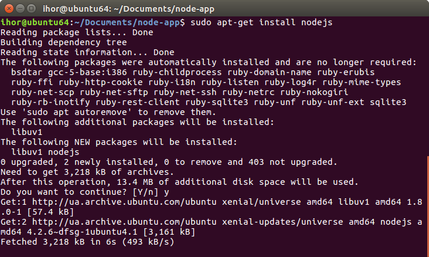

# Node.js

Node.js дозволяє писати серверну частину проекту на JavaScript.

> Оскільки Node.js запускається на сервері, то у розробника нема доступу до глобальних об’єктів document та window, які доступні в браузері.

## Встановлення Node.js

Оскільки для Windows та Macintosh процес втановлення простий, то ми для прикладу розглянемо, як це зробити для Ubuntu.

> Щоб встановити Node.js для Windows чи Macintosh, достатнньо з офіційного сайту [https://nodejs.org](https://nodejs.org) завантажити встановлювач \(англ. installer\) і слідувати інструкціям.

Спочатку оновимо локальний індекс пакетів, а потім встановимо дистрибутив з репозиторіїв:

`$ sudo apt-get update
`

`$ sudo apt-get install nodejs
`

> **Зверніть увагу**, що пакет в Ubuntu називається nodejs, а не node.

Також можна встановити npm — менеджер пакетів для Node.js:

`$ sudo apt-get install npm
`

Щоб перевірити версію Node.js, запустіть:

`$ nodejs -v
`

`v4.2.6
`

І для npm:

`$ npm -v
`

`3.5.2`

